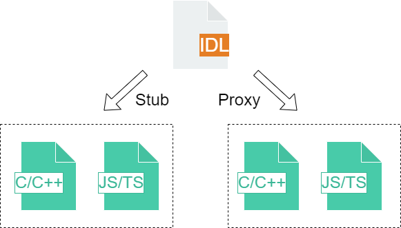
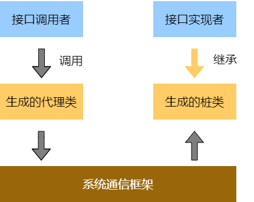

# IDL工具

## 简介

在OpenHarmony中，当应用/系统服务的客户端和服务端进行IPC（Inter-Process Communication）跨线程通信时，需要定义双方都认可的接口，以保障双方可以成功通信，OpenHarmony IDL（Interface Definition Language）则是一种定义此类接口的工具。OpenHarmony IDL先把需要传递的对象分解成操作系统能够理解的基本类型，并根据开发者的需要封装跨边界的对象。

  **图1** IDL接口描述
  

OpenHarmony  IDL接口描述语言主要用于：

- 声明系统服务对外提供的服务接口，根据接口声明在编译时生成跨进程调用（IPC）或跨设备调用（RPC）的代理（Proxy）和桩（Stub）的C/C++代码或JS/TS代码。

- 声明Ability对外提供的服务接口，根据接口声明在编译时生成跨进程调用（IPC）或跨设备调用（RPC）的代理（Proxy）和桩（Stub）的C/C++代码或JS/TS代码。

**图2** IPC/RPC通信模型



使用OpenHarmony IDL接口描述语言声明接口具有以下优点：

- OpenHarmony IDL中是以接口的形式定义服务，可以专注于定义而隐藏实现细节。

- OpenHarmony IDL中定义的接口可以支持跨进程调用或跨设备调用。根据OpenHarmony IDL中的定义生成的信息或代码可以简化跨进程或跨设备调用接口的实现。

**部件内子模块职责**

| 子模块名称       | 职责                                                         |
| ---------------- | ------------------------------------------------------------|
| 接口文件解析模块         | 解析校验接口定义文件。                                    |
| stub/proxy自动生成模块   | 根据IPC/RPC规格自动生成Stub服务端和Proxy客户端代码。         |

## 目录

```
foundation/ability/idl_tool
├── ast                         # idl语法解析定义代码
├── codegen                     # 跨进程通信模板生成模块代码
├── metadata                    # matedata自定义数据解析模块代码
├── parser                      # idl解析模块代码
├── test                        # 测试目录
└── util                        # 公共方法代码
```

## 开发步骤
idl工具的获取和TS开发步骤可参考[开发指南](https://gitee.com/openharmony/docs/blob/master/zh-cn/application-dev/IDL/idl-guidelines.md#31-c%E5%BC%80%E5%8F%91%E6%AD%A5%E9%AA%A4)。

### C++开发步骤

#### 创建.idl文件

开发者可以使用C++编程语言构建.idl文件。

例如，此处构建一个名为IIdlTestService.idl的文件，文件内具体内容如下：

```cpp
  interface OHOS.IIdlTestService {
      int TestIntTransaction([in] int data);
      void TestStringTransaction([in] String data);
  }
```

在idl的可执行文件所在文件夹下执行命令 `idl -gen-cpp -d dir -c dir/IIdlTestService.idl`。

-d后的dir为目标输出目录，以输出文件夹名为IIdlTestServiceCpp为例，在idl可执行文件所在目录下执行`idl -gen-cpp -d IIdlTestServiceCpp -c IIdlTestServiceCpp/IIdlTestService.idl`，将会在执行环境的dir目录（即IIdlTestServiceCpp目录）中生成接口文件、Stub文件、Proxy文件。

 > **注意**：生成的接口类文件名称和.idl文件名称保持一致，否则会生成代码时会出现错误。

以名为`IIdlTestService.idl`的.idl文件、目标输出文件夹为IIdlTestServiceCpp为例，其目录结构应类似于:

```
├── IIdlTestServiceCpp  # idl代码输出文件夹
│   ├── iidl_test_service.h  # 生成文件
│   ├── idl_test_service_proxy.h  # 生成文件
│   ├── idl_test_service_stub.h  # 生成文件
│   ├── idl_test_service_proxy.cpp  # 生成文件
│   ├── idl_test_service_stub.cpp  # 生成文件
│   └── IIdlTestService.idl  # 构造的.idl文件
└── idl.exe  # idl的可执行文件
```

#### 服务端公开接口

OpenHarmony IDL工具生成的Stub类是接口类的抽象实现，并且会声明.idl文件中的所有方法。

```cpp
#ifndef OHOS_IDLTESTSERVICESTUB_H
#define OHOS_IDLTESTSERVICESTUB_H
#include <iremote_stub.h>
#include "iidl_test_service.h"

namespace OHOS {
class IdlTestServiceStub : public IRemoteStub<IIdlTestService> {
public:
    int OnRemoteRequest(
        /* [in] */ uint32_t code,
        /* [in] */ MessageParcel& data,
        /* [out] */ MessageParcel& reply,
        /* [in] */ MessageOption& option) override;

private:
    static constexpr int COMMAND_TEST_INT_TRANSACTION = MIN_TRANSACTION_ID + 0;
    static constexpr int COMMAND_TEST_STRING_TRANSACTION = MIN_TRANSACTION_ID + 1;
};
} // namespace OHOS
#endif // OHOS_IDLTESTSERVICESTUB_H
```

开发者需要继承.idl文件中定义的接口类并实现其中的方法，同时在服务侧初始化时需要将定义的服务注册至SAMGR中，在本示例中，TestService类继承了IdlTestServiceStub接口类并实现了其中的TestIntTransaction和TestStringTransaction方法。具体的示例代码如下：

```cpp
#ifndef OHOS_IPC_TEST_SERVICE_H
#define OHOS_IPC_TEST_SERVICE_H

#include "hilog/log.h"
#include "log_tags.h"
#include "idl_test_service_stub.h"

namespace OHOS {
class TestService : public IdlTestServiceStub {
public:
    TestService();
    ~TestService();
    static int Instantiate();
    ErrCode TestIntTransaction(int data, int &rep) override;
    ErrCode TestStringTransaction(const std::string& data) override;
private:
    static constexpr HiviewDFX::HiLogLabel LABEL = { LOG_CORE, LOG_ID_IPC, "TestService" };
};
} // namespace OHOS
#endif // OHOS_IPC_TEST_SERVICE_H
```

注册服务的示例代码如下：

```cpp
#include "test_service.h"

#include <string_ex.h>

#include "if_system_ability_manager.h"
#include "ipc_debug.h"
#include "ipc_skeleton.h"
#include "iservice_registry.h"
#include "system_ability_definition.h"

namespace OHOS {
using namespace OHOS::HiviewDFX;

int TestService::Instantiate()
{
    ZLOGI(LABEL, "%{public}s call in", __func__);
    auto saMgr = SystemAbilityManagerClient::GetInstance().GetSystemAbilityManager();
    if (saMgr == nullptr) {
        ZLOGE(LABEL, "%{public}s:fail to get Registry", __func__);
        return -ENODEV;
    }

    sptr<IRemoteObject> newInstance = new TestService();
    int result = saMgr->AddSystemAbility(IPC_TEST_SERVICE, newInstance);
    ZLOGI(LABEL, "%{public}s: IPC_TEST_SERVICE result = %{public}d", __func__, result);
    return result;
}

TestService::TestService()
{
}

TestService::~TestService()
{
}

ErrCode TestService::TestIntTransaction(int data, int &rep)
{
    ZLOGE(LABEL, " TestService:read from client data = %{public}d", data);
    rep = data + data;
    return ERR_NONE;
}

ErrCode TestService::TestStringTransaction(const std::string &data)
{
    ZLOGE(LABEL, "TestService:read string from client data = %{public}s", data.c_str());
    return data.size();
}
} // namespace OHOS
```

#### 客户端调用IPC方法

C++客户端通常通过SAMGR获取系统中定义的服务代理，随后即可正常调用proxy提供的接口。示例代码如下：

```cpp
#include "test_client.h"

#include "if_system_ability_manager.h"
#include "ipc_debug.h"
#include "ipc_skeleton.h"
#include "iservice_registry.h"
#include "system_ability_definition.h"

namespace OHOS {
int TestClient::ConnectService()
{
    auto saMgr = SystemAbilityManagerClient::GetInstance().GetSystemAbilityManager();
    if (saMgr == nullptr) {
        ZLOGE(LABEL, "get registry fail");
        return -1;
    }

    sptr<IRemoteObject> object = saMgr->GetSystemAbility(IPC_TEST_SERVICE);
    if (object != nullptr) {
        ZLOGE(LABEL, "Got test Service object");
        testService_ = (new (std::nothrow) IdlTestServiceProxy(object));
    }

    if (testService_ == nullptr) {
        ZLOGE(LABEL, "Could not find Test Service!");
        return -1;
    }

    return 0;
}

void TestClient::StartIntTransaction()
{
    if (testService_ != nullptr) {
        ZLOGE(LABEL, "StartIntTransaction");
        [[maybe_unused]] int result = 0;
        testService_->TestIntTransaction(1234, result); // 1234 : test number
        ZLOGE(LABEL, "Rec result from server %{public}d.", result);
    }
}

void TestClient::StartStringTransaction()
{
    if (testService_ != nullptr) {
        ZLOGI(LABEL, "StartIntTransaction");
        testService_->TestStringTransaction("IDL Test");
    }
}
} // namespace OHOS
```

## C++与TS互通开发步骤

### TS Proxy与C++ Stub开发步骤

#### C++端提供服务对象

1. 如上所述C++开发步骤，开发者使用C++编程语言构建.idl文件，通过命令生成接口、Stub文件、Proxy文件。

2. 开发者创建服务对象，并继承C++ Stub文件中定义的接口类并实现其中的方法，例如：

   ```cpp
   class IdlTestServiceImpl : public IdlTestServiceStub {
   public:
       IdlTestServiceImpl() = default;
       virtual ~IdlTestServiceImpl() = default;

       ErrCode TestIntTransaction(int _data, int& result) override
       {
            result = 256;
            return ERR_OK;
       }

       ErrCode TestStringTransaction(const std::string& _data) override
       {
            return ERR_OK;
       }
   };
   ```

#### C++端提供napi接口

C++需要通过napi的方式，把C++服务对象提供给TS端，例如：C++端提供一个GetNativeObject方法，方法里创建IdlTestServiceImpl实例，通过NAPI_ohos_rpc_CreateJsRemoteObject方法，创建出一个JS远程对象供TS应用使用，如下：

```cpp
napi_value GetNativeObject(napi_env engine, napi_callback_info info)
{
    sptr<IdlTestServiceImpl> impl = new IdlTestServiceImpl();
    napi_value napiRemoteObject = NAPI_ohos_rpc_CreateJsRemoteObject(engine, impl);
    return nativeRemoteObject;
}
```

#### TS端提供Proxy对象

如上所述TS开发步骤，开发者使用TS编程语言构建.idl文件，通过命令生成接口、Stub文件、Proxy文件。Proxy文件例如：

```ts
import {testIntTransactionCallback} from "./i_idl_test_service";
import {testStringTransactionCallback} from "./i_idl_test_service";
import IIdlTestService from "./i_idl_test_service";
import rpc from "@ohos.rpc";

export default class IdlTestServiceProxy implements IIdlTestService {
    constructor(proxy) {
        this.proxy = proxy;
    }

    testIntTransaction(data: number, callback: testIntTransactionCallback): void
    {
        let _option = new rpc.MessageOption();
        let _data = new rpc.MessageParcel();
        let _reply = new rpc.MessageParcel();
        _data.writeInt(data);
        this.proxy.sendMessageRequest(IdlTestServiceProxy.COMMAND_TEST_INT_TRANSACTION, _data, _reply, _option).then(function(result) {
            if (result.errCode == 0) {
                let _errCode = result.reply.readInt();
                if (_errCode != 0) {
                    let _returnValue = undefined;
                    callback(_errCode, _returnValue);
                    return;
                }
                let _returnValue = result.reply.readInt();
                callback(_errCode, _returnValue);
            } else {
                console.log('sendMessageRequest failed, errCode: ' + result.errCode);
            }
        })
    }

    testStringTransaction(data: string, callback: testStringTransactionCallback): void
    {
        let _option = new rpc.MessageOption();
        let _data = new rpc.MessageParcel();
        let _reply = new rpc.MessageParcel();
        _data.writeString(data);
        this.proxy.sendMessageRequest(IdlTestServiceProxy.COMMAND_TEST_STRING_TRANSACTION, _data, _reply, _option).then(function(result) {
            if (result.errCode == 0) {
                let _errCode = result.reply.readInt();
                callback(_errCode);
            } else {
                console.log('sendMessageRequest failed, errCode: ' + result.errCode);
            }
        })
    }

    static readonly COMMAND_TEST_INT_TRANSACTION = 1;
    static readonly COMMAND_TEST_STRING_TRANSACTION = 2;
    private proxy
}
```

#### TS与C++实现互通

1. TS应用调用napi接口获取C++服务的远程对象
2. 构建TS Proxy对象，并把C++服务的远程对象传递给它
3. 此时开发者通过TS Proxy对象调用.idl声明的方法，实现TS Proxy与C++ Stub的互通，示例如下：

```ts
import IdlTestServiceProxy from './idl_test_service_proxy'
import nativeMgr from 'nativeManager';

function testIntTransactionCallback(errCode: number, returnValue: number)
{
    console.log('errCode: ' + errCode + '  returnValue: ' + returnValue);
}

function testStringTransactionCallback(errCode: number)
{
    console.log('errCode: ' + errCode);
}

function jsProxyTriggerCppStub()
{
    let nativeObj = nativeMgr.GetNativeObject();
    let tsProxy = new IdlTestServiceProxy(nativeObj);
    // invoke testIntTransaction
    tsProxy.testIntTransaction(10, testIntTransactionCallback);

    // invoke testStringTransaction
    tsProxy.testStringTransaction('test', testIntTransactionCallback);
}
```

## 相关仓
元能力子系统

[ability_base](https://gitee.com/openharmony/ability_ability_base)

[ability_runtime](https://gitee.com/openharmony/ability_ability_runtime)

[dmsfwk](https://gitee.com/openharmony/ability_dmsfwk)

[form_fwk](https://gitee.com/openharmony/ability_form_fwk)

[**idl_tool**](https://gitee.com/openharmony/ability_idl_tool)
